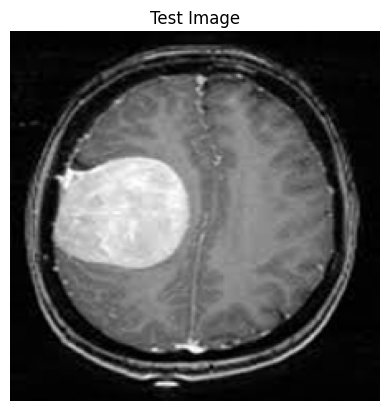
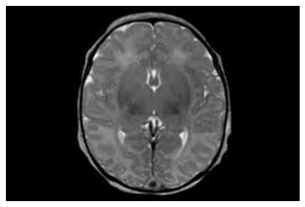
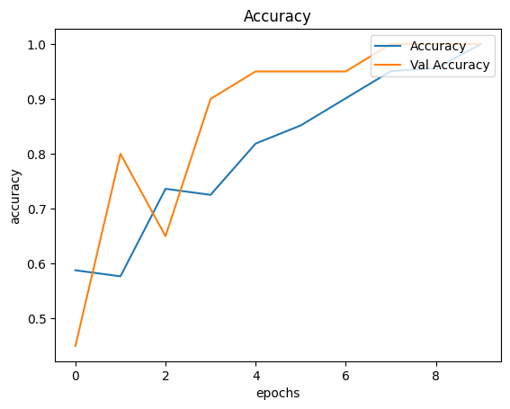
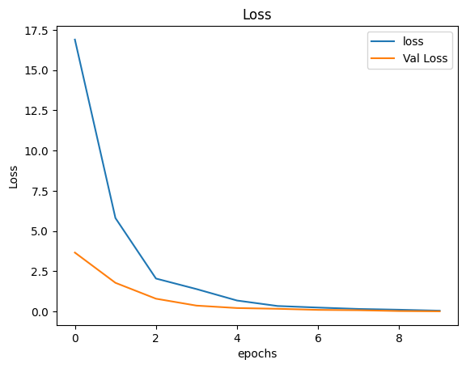

<h1 align="center">🧠 Deteksi Tumor Otak dari Citra MRI dengan CNN</h1>
<p align="center">Sebuah implementasi Deep Learning untuk mengklasifikasikan tumor otak secara otomatis melalui gambar MRI.</p>

<div align="center">


</div>

---

## 👨‍💻 Tentang Proyek

Proyek ini bertujuan untuk mengembangkan sistem klasifikasi gambar medis berbasis CNN (Convolutional Neural Network) yang mampu mengidentifikasi keberadaan tumor otak pada citra MRI. Model ini dilatih menggunakan dataset publik dari Kaggle dan mampu membedakan secara biner antara citra yang menunjukkan tumor dan yang tidak.

---

## 🧰 Teknologi yang Digunakan

- **Python**: Bahasa pemrograman utama untuk membangun pipeline.
- **TensorFlow & Keras**: Framework utama untuk membangun dan melatih model CNN.
- **OpenCV & PIL**: Digunakan untuk pemrosesan gambar, termasuk resize dan konversi RGB.
- **NumPy**: Manipulasi array dan representasi numerik citra.
- **Matplotlib**: Visualisasi data seperti akurasi, loss, dan citra hasil klasifikasi.
- **Scikit-learn**: Digunakan untuk membagi data dan evaluasi performa model.
- **Google Colab**: Platform berbasis cloud dengan akses GPU untuk pelatihan model.
- **KaggleHub**: Untuk mengimpor dataset langsung dari Kaggle.

---

## 🧠 Arsitektur CNN

Model CNN disusun dengan pendekatan sederhana namun efektif, cocok untuk klasifikasi biner citra MRI:

```text
Input (224x224x3)
↓
Conv2D (32 filters, 3x3, relu)
↓
MaxPooling2D (2x2)
↓
Flatten
↓
Dense (256, relu)
↓
Dropout (rate=0.5)
↓
Dense (1, sigmoid)
```

Model menggunakan **loss binary crossentropy** dan **optimizer Adam** untuk proses training.

---

## 🔄 Alur Kerja Sistem

### 1. Data Preparation
- Dataset MRI diunduh dari Kaggle (class: `yes` & `no`)
- Gambar di-resize ke 224x224 dan dinormalisasi

### 2. Labeling dan Splitting
- Gambar bertumor diberi label `1`, tanpa tumor diberi label `0`
- Dataset dibagi menjadi training, validation, dan test set

### 3. Model Training
- CNN dilatih selama 10 epoch
- Monitoring dilakukan menggunakan validation set

### 4. Evaluasi & Visualisasi
- Plot akurasi dan loss untuk analisis kinerja model

### 5. Pengujian Model
- Gambar eksternal dapat diunggah dan diprediksi secara langsung

---

## 🖼️ Hasil Prediksi

| Gambar MRI | Hasil Prediksi | Confidence Score |
|------------|----------------|------------------|
|  | Tumor detected | 99% |
|  | No tumor detected | 87% |

> Catatan: Prediksi menggunakan gambar baru dari pengguna dengan proses preprocessing yang sama seperti saat training.

---

## 📈 Visualisasi Hasil

### Akurasi Training vs Validation


### Loss Training vs Validation


---

## 💡 Tips Pengembangan

- Tambahkan **data augmentation** untuk membuat model lebih general  
- Gunakan **callback** seperti `EarlyStopping` untuk menghentikan training saat overfitting  
- Coba eksplorasi arsitektur lain seperti **ResNet** atau **MobileNet** untuk peningkatan performa  

---

## 🚀 Tantangan Lanjutan

- **Multiklasifikasi**: Deteksi jenis-jenis tumor secara spesifik  
- **Segmentasi Citra**: Tandai lokasi tumor dalam gambar, bukan hanya klasifikasi  
- **Integrasi Aplikasi**: Bangun antarmuka sederhana untuk dokter atau pengguna awam  
- **Explainable AI**: Tambahkan fitur seperti **Grad-CAM** untuk interpretabilitas model  

---

## 📦 Dataset

Dataset digunakan dari Kaggle:  
🔗 [Brain MRI Images for Brain Tumor Detection](https://www.kaggle.com/datasets/navoneel/brain-mri-images-for-brain-tumor-detection)

